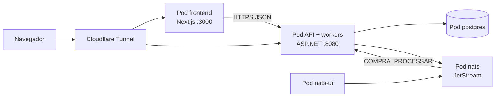

# Kubernetes — Autonomous Audit

Este diretório descreve os **pods e serviços** que sustentam a aplicação no cluster (namespace `dotnet`). Os valores de senha, token e chave **não** estão neste repositório. Use os arquivos `*-secret.example.yaml` como modelo e crie Secrets no cluster.

A publicação contínua (GitHub Actions + runner self-hosted) permanece nos repositórios **privados** de manutenção. Aqui o objetivo é documentar a topologia para avaliação e reprodução.

## Fluxo entre os containers

O navegador chega pelo Cloudflare Tunnel. O pod do frontend chama a API; a API persiste no PostgreSQL, publica e consome filas no NATS e fala com serviços externos (Perplexity, Dropbox, SMTP, Seq). A UI do NATS consulta o broker no cluster.



HTTPS público: realizar via painel CF para exposição da API e do sistema via tunnelling (NodePorts 30081 e 30085).

## Pods

| Recurso | Manifesto | Função | Exposição |
| --- | --- | --- | --- |
| Namespace `dotnet` | `namespace.yaml` | Isola a carga | — |
| **postgres** | `postgres.yaml` | PostgreSQL 16 (dados da aplicação) | ClusterIP `:5432` |
| **nats** | `nats.yaml` | Broker JetStream (filas de processamento) | ClusterIP `:4222` |
| **nats-ui** | `nats.yaml` | Console NATS atrás de nginx com Basic Auth | NodePort **30082** |
| **api** | `api.yaml` | ASP.NET Core 8 (API de recibos, cadastros e relatório) | NodePort **30081** |
| **frontend** | `frontend.yaml` | Next.js 15 (interface) | NodePort **30085** |

Imagens da API e do frontend são construídas localmente (`imagePullPolicy: Never`). Tags de exemplo: `dotnet-api:latest` e `autonomous-audit-web:latest`.

## Secrets (obrigatórios)

| Secret | Modelo | Conteúdo típico |
| --- | --- | --- |
| `postgres-secret` | `postgres-secret.example.yaml` | Usuário, senha, banco e connection string |
| `nats-secret` | `nats-secret.example.yaml` | Usuário/senha do broker, Basic Auth da UI, contexto JSON |
| `api-secret` | `api-secret.example.yaml` | JWT, Perplexity, Dropbox, SMTP, Seq, SMS, Google Client ID |
| `frontend-secret` | `frontend-secret.example.yaml` | `GOOGLE_CLIENT_ID`, `GOOGLE_CLIENT_SECRET`, `NEXTAUTH_SECRET` |

```bash
kubectl apply -f k8s/namespace.yaml
kubectl -n dotnet apply -f k8s/postgres-secret.local.yaml
kubectl -n dotnet apply -f k8s/nats-secret.local.yaml
kubectl -n dotnet apply -f k8s/api-secret.local.yaml
kubectl -n dotnet apply -f k8s/frontend-secret.local.yaml
```

## Ordem de aplicação

```bash
kubectl apply -f k8s/namespace.yaml
# secrets (arquivos locais)
kubectl apply -f k8s/postgres.yaml
kubectl apply -f k8s/nats.yaml
# construir imagens no Docker do cluster (minikube docker-env)
kubectl apply -f k8s/api.yaml
kubectl apply -f k8s/frontend.yaml
```

`ingress.yaml` é **documentação**. Neste ambiente o HTTPS fica no Cloudflare Tunnel apontando para os NodePorts; não há Ingress controller.

## Conferência

```bash
kubectl -n dotnet get pods,svc
kubectl -n dotnet rollout status deploy/api
kubectl -n dotnet rollout status deploy/frontend
curl -sS -o /dev/null -w '%{http_code}\n' http://127.0.0.1:30081/health
```

Ambiente publicado de avaliação (já no ar):

- Interface: https://autonomousaudit.canada-software.com.br/
- API / Swagger: https://autonomousauditapi.canada-software.com.br/swagger/index.html
